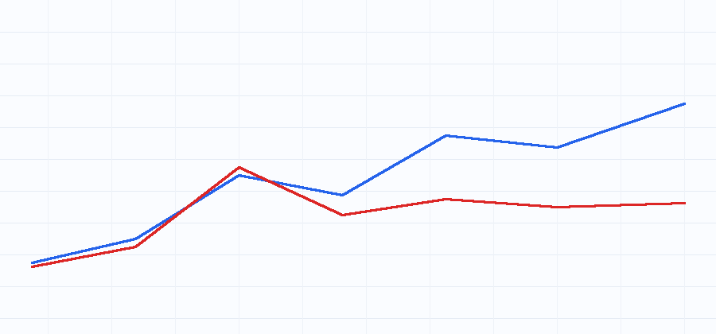
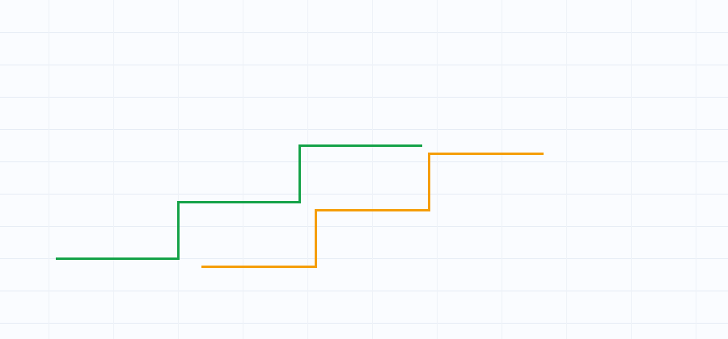

# confluence-scanner

Walk-forward-first crypto signal framework. Stop deploying overfit strategies.

[](https://github.com/baronguyen001/confluence-scanner/actions/workflows/ci.yml)
[](LICENSE)
[](pyproject.toml)



Most crypto signal repos show a backtest and stop there. `confluence-scanner` starts with walk-forward validation: tune on one window, validate on the next, repeat, and label ideas as robust or overfit before they reach alerts.

This is a framework, bring your own thresholds. The example config uses placeholder weights and textbook indicator settings. The production edge is intentionally not included.

## 30-second example

```bash
pip install -e .
confscan scan --config examples/btc_eth_solana/config.yaml
confscan backtest --config examples/btc_eth_solana/config.yaml --html reports/backtest.html
confscan walkforward --config examples/btc_eth_solana/config.yaml
```

```python
from confscan import ConfluenceScorer, ema, detect_cross, klines, run_backtest

df = klines("BTCUSDT", interval="4h", lookback="180d")
fast = ema(df["close"], 12)
slow = ema(df["close"], 26)
cross = detect_cross(fast, slow)

result = run_backtest(df, cross == 1, cross == -1, fee_bps=10)
score = ConfluenceScorer().score(
    "BTCUSDT",
    {"ta": 65, "fa": 50, "cex": 55, "onchain": 0},
    present={"ta": True, "fa": True, "cex": True, "onchain": False},
)
print(result.metrics)
print(score.to_dict())
```

## What's In The Box

- Pure-pandas TA: EMA, RSI, MACD, Bollinger Bands, ATR, ADX, Stochastic, OBV, and MFI. No TA-Lib and no pandas-ta.
- Adaptive confluence scoring across TA, fundamentals, CEX flow, and on-chain layers.
- Optional ADX/ATR confluence inputs with zero default weight, so shipped scoring behavior stays unchanged until you opt in.
- Optional public order-flow confluence input for open interest, long/short ratio, and liquidation balance. It ships with zero default weight, so scoring behavior stays unchanged until you opt in.
- Two independent funding-rate sources (Binance and Bybit) selectable via config, so a single venue outage does not blank the CEX layer.
- Walk-forward splitting with a no-leakage assertion and robust/overfit labels.
- Signal-driven long-only backtest engine with fees and optional stops supplied by the caller.
- Per-regime backtest metrics (bull/bear/chop) in the table and HTML report via `--by-regime`.
- Monte Carlo robustness checks for backtest results via trade-order shuffle and bootstrap simulation.
- HTML backtest reports with an embedded equity curve PNG, metrics, and per-fold tables.
- A single static HTML dashboard aggregating the latest scan and recent backtest reports.
- Public data adapters for Binance, Bybit, CoinGecko, GeckoTerminal, and DefiLlama.
- Telegram, Discord, and Slack webhook alerts with chunking and retry handling.
- Optional Gemini commentary that is neutral, generic, and never trading advice.
- Scheduler emitters for cron, launchd, and Windows Task Scheduler.

## Alerts

Choose an alert route in config:

```yaml
alert:
  channel: telegram+discord+slack
```

Secrets stay in environment variables:

```text
TELEGRAM_BOT_TOKEN=your_bot_token
TELEGRAM_CHAT_ID=your_chat_id
DISCORD_WEBHOOK_URL=your_discord_webhook_url
SLACK_WEBHOOK_URL=your_slack_webhook_url
```

`alert.channel` accepts `telegram`, `discord`, `slack`, legacy `both` for Telegram plus Discord, `all`, or combinations such as `telegram,slack`.

## HTML Reports

```bash
confscan backtest --config examples/btc_eth_solana/config.yaml --html reports/backtest.html
```

The report embeds a generated PNG equity curve and includes metrics plus a compact fold table for each configured symbol.

Add Monte Carlo robustness simulation to include a confidence band and drawdown distribution table in the HTML report:

```bash
confscan backtest --config examples/btc_eth_solana/config.yaml --montecarlo 500 --montecarlo-seed 42 --html reports/backtest.html
```

The simulation shuffles observed trade returns and bootstraps sampled trade returns. It is a robustness diagnostic, not a tuned approval rule.

## Order Flow Layer

The optional order-flow layer reads free public Binance futures market data for open-interest history, top-account long/short ratio, and liquidation orders:

```yaml
weights:
  ta: 0.40
  fa: 0.20
  cex: 0.20
  onchain: 0.20
  orderflow: 0.00
```

The default is `0.00`, so public scoring is unchanged. Set your own weight only after validating it in your own walk-forward process.

## Funding Source

The CEX funding sub-score can read from Binance, Bybit, OKX, or an average of Binance+Bybit. The default is `binance`, so shipped behavior is unchanged. All sources normalize to the same `['fundingRate']` frame, so picking a source is a one-line config change:

```yaml
data:
  funding_source: both  # binance (default), bybit, okx, or both
```

`both` averages overlapping timestamps and falls back to whichever venue returned data, which smooths over a single exchange's outage. You can also set `CONFSCAN_FUNDING_SOURCE` in the environment.

## Regime Split

Slice backtest metrics by market regime to see where an idea actually works instead of trusting one blended number:

```bash
confscan backtest --config examples/btc_eth_solana/config.yaml --by-regime --html reports/backtest.html
```

Each bar is labelled `bull`, `bear`, or `chop` from a simple, generic trend/volatility rule (a trend-EMA slope compared against a volatility band). The console table and the HTML report then show Sharpe, CAGR, max drawdown, and win rate per regime. The rule is intentionally generic, not a tuned production filter.

## Dashboard

Render a single self-contained HTML page (no JavaScript) that aggregates the latest scan output and links to the most recent backtest reports:

```bash
confscan dashboard --config examples/btc_eth_solana/config.yaml --out dashboard.html --reports-dir reports
```

The dashboard is a static file you can open directly or host anywhere. It discovers recent `*.html` reports in `--reports-dir` and links to them relative to the dashboard's own location.

## Walk-Forward Demo

The differentiator is in [`examples/walk_forward_demo`](examples/walk_forward_demo/). It uses an offline OHLCV fixture, splits rolling train/validation windows, and plots in-sample versus out-of-sample Sharpe divergence.



## Honest Rejections

[`examples/rejected_experiments`](examples/rejected_experiments/) shows a generic filter idea that looks plausible and then fails to improve validation performance. This is how you reject ideas. A framework that cannot kill its darlings is overfitting.

## Bring Your Own Thresholds

This is a framework, bring your own thresholds. The public defaults are round placeholders for examples and tests. Tune your own weights, filters, stops, and universe choices on your own walk-forward process.

## Comparison

| Tool | Best for | Where this repo differs |
| --- | --- | --- |
| Freqtrade | Full trading bots | `confscan` is research/alerts first, not order routing. |
| Backtrader | General backtesting | `confscan` ships crypto data adapters and walk-forward helpers. |
| vectorbt | Fast vectorized research | `confscan` is simpler, CLI-first, and batteries-included for alerts. |

## Quickstart

```bash
python -m venv .venv
.venv\Scripts\activate  # Windows
pip install -e ".[dev,viz]"
confscan doctor
confscan scan --config examples/btc_eth_solana/config.yaml
pytest --cov=confscan --cov-fail-under=75
```

PyPI publishing is pending for v0.2. Until then, install from source.

## -> Trawlkit

`confluence-scanner` is one application of the same loop Trawlkit packages for automation work:

```text
scrape -> score -> AI -> alert -> schedule
```

See [Trawlkit](https://github.com/baronguyen001/trawlkit) for the reusable kit, and [ai-automation-skills](https://github.com/baronguyen001/ai-automation-skills) for free companion material.

MIT licensed.
